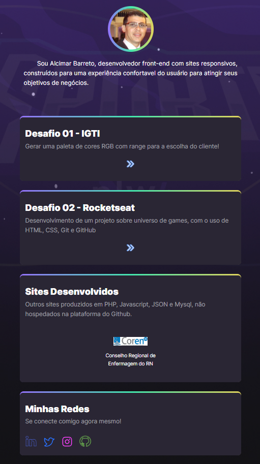

# Alcimar Barreto - Página Principal

 > Portfólio de Estudos HTML & CSS

[Abrir Página](https://alcimarbarreto.github.io/)

## Softskills:

* ### Microsoft Office

    * 

* ### IDE's de desenvolvimento

    *  
    *  

* ### Gerenciadores de banco de dados relacional

    * 
    * 

## Hardskills

* :handshake: Empatia
* :muscle: Resiliência
* :nerd_face: Proatividade
* :books: Autoconhecimento
* :brain: Inteligência emocional

## Desenvolvimento

   * 
   * 
   * 
   * 
   * 
   * 
   * 
   * 

## Contato

<!--

### Conecte-se comigo

### Habilidades

 

### GitHub Stats

-->

### Meus Principais Desafios de Projeto DIO

